# Preface:

Welcome to 2. MP: Research section of my malware analysis series. 

 

Although we will be covering some cryptography theory, I've kept it relevant and visualised it as best I can. I've provided some resources at the end of the room in the "Further Reading" task for each of the topics covered. 

You can expect to learn about file checksums, why these values are important in not only day-to-day life but more so how we can utilise them in malware analysis. The first few tasks are theory-heavy, so bear with me. However, towards the end of the room, you will be generating your own checksums, learning how to use online sandboxing, and analysing the reports generated from these.

.:.

As always, any feedback regarding the content covered through the series so far is greatly appreciated. I always welcome ideas of topics, tools, and techniques that could be covered.

.:.

~CMNatic

# Deploy!

Deploy the instance attached to this task by left-clicking the green "Deploy" button on the top-right of this task!

 

You are not expected to interact with the instance just yet - you will be provided credentials later on throughout the room. But please ensure you are connected to the TryHackMe OpenVPN before proceeding.

# Checksums 101

What are Checksums?

Checksums are a prominent attribute within the malware analysis community. But moreover, the wider Information Technology (IT) industry. Put simply, these checksums are the result of mathematical operations against an input - where the output is a sequence of characters.

Ultimately, the markup of data on a computer system is binary, merely ones and zeros where each value is a "bit". A cryptographic checksum uses these "bits" as the input for these mathematical operations; the increased complexity of the mathematical operations applied, the more secure a checksum is considered. These checksums are also commonly referred to as "hashes".

Because of how cryptographic algorithms work, regardless of the size of the input - such as a file - the length of the output will remain the same. For example, take an algorithm and apply these mathematical operations against two files listed below:

<table class="table table-bordered" style="width:1046px;"><tbody><tr><td>File Name</td><td>File Size</td></tr><tr><td>My_Video.mp4</td><td>4GB</td></tr><tr><td>My_Selfie.png</td><td>10MB</td></tr></tbody></table>

Although the file size is vastly different, the length of the output calculated will be the same, albeit its contents different. For example, in this algorithm I have as an example, the output length is 12 characters:

<table class="table table-bordered" style="width:1046px;"><tbody><tr><td>File Name	 </td><td>File Size</td><td>The output from the Algorithm</td></tr><tr><td>My_Video.mp4</td><td>4GB</td><td>3DEFAD92D23AD</td></tr><tr><td>My_Selfie.png</td><td>10MB</td><td>FFDE312DAEFF</td></tr></tbody></table>

Whilst the values calculated from the algorithm are different from each file, they remain the same length - irrespective of the file size. Because the two files have different contents, in this case, each output is unique for the file.

The increased complexity of the mathematical operations vastly reduces the chances of two files with different contents from having the same output. If this was to occur, it is known as a "hash collision". Explaining the math behind how this happens is out of scope, however, it is extremely rare. To put into perspective, the hashing algorithm MD5 which is a famous recent example will need 6 billion files to be hashed per second - for 100 years on average. (Kornel., 2008) 

Whilst it's pretty safe to say that the probability of a hash collision occurring is pretty low, it is mathematically possible. For example, researchers (Stevens et al., 2017) report on Shattered.io, where they were able to demonstrate a SHA1 hash collision in practice. I greatly encourage taking the time to read through the report to understand how these collisions can be made into proof of concepts but to also appreciate why discoveries like this are important in the world of information security.

It's safe to say it's pretty rare for this error to happen, although it is mathematically possible. We'll visualise this below.

## Checksums Continued:

Let's contextualise checksums a bit more. In IT, checksums are used for verifying the integrity of data. Have you ever copied a file onto a USB drive where Windows complains that the file is now corrupt? That is data corruption; binary data was lost somewhere during the transfer process, either due to software or hardware error.

Due to how these cryptographic algorithms work, namely, they produce a result after processing a piece of data at every single bit, checksums are fantastic for verifying if data has completely copied to a new location. Humans can't compare the binary data (which could be millions of values to compare) of two files to ensure they are correct. They can, however, compare two-fixed length values - such as the 12 character length output of the algorithm specified above. In the real-world, some popular algorithms are SHA1, SHA-256 and in some cases, SHA-512, where the output length of each algorithm is varied based on its security.

We'll visualise how hashing algorithms work below:

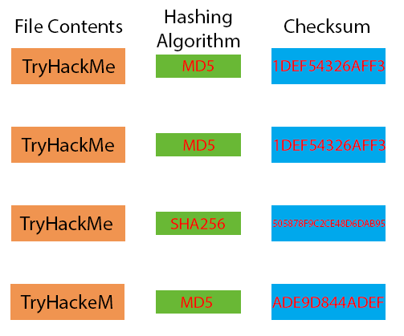

See here how the contents of the first two files are the same with "TryHackMe". When using the same algorithm, the generated checksum is the same. This is because the binary data of these two files are identical, so the same algorithm will output the same result. This is not a hash collision.

Notice the third file with the same contents of "TryHackMe" resulting in the same binary data has a different checksum. This is because the algorithm, in this case, SHA256 instead of the previous MD5, uses different mathematical operations. The mathematics behind this algorithm is complex in comparison to MD5, so the length of the output string is longer.

Finally, notice in the screenshot below (the last file in the screenshot above, just cropped below for clarity) that the contents of the file are now "TryHackeM" and not "TryHackMe":

Whilst the same algorithm used on the first two files are also used on this file (MD5) because the contents are now different - albeit very similar - the output is now different in comparison.

 
 ## Q & A

Q! Name the term for an individual piece of binary

A1 bit

Q2 What are checksums also known as?

A2 hashes

Q3 Name the algorithm that is next in the series after SHA-256

SHA-512

Q4 According to this task, how long will you need to hash 6 million files before a MD5 hash collision occurs?

A4 100 years

Q5 Who developed the MD5 algorithm?

A5 Ronald Rivest

# Online Sandboxing

What is Online Sandboxing?

 

Sometimes things are left best to the experts. That's especially true in the case of malware analysis. However, online sandboxing hosts use to a wider audience than just hobbyists.

In the context of information security, sandboxing is the technique used to isolate processes to prevent direct interaction with one another. There are many examples of this. For example, using Virtualbox as a Hypervisor to run the Kali Linux operating system virtually, in parallel on your main computer. The processes within Kali Linux interact only through the means of Virtualbox and has no interference with processes on your main operating system, such as Windows.

In a malware analysis context, analysts employ virtual environments - such as those on TryHackMe, to facilitate analysis of potentially malicious code more securely.

Now, with this being said, malware has been known and can very well escape this virtual environment onto the analyst's host system. Whilst this risk is somewhat limited to sophisticated malware, it's very achievable. For example, CVE-2018-2689 is a CVE for Virtualbox where malware was capable of escaping this restricted virtual environment. CVE's such as these are extremely valuable and seldom disclosed due to the actors who discover them and their intentions, namely malicious malware authors.

I've written more about how malware detects it is in a virtual environment and the possible routes it can take to escape on my [blog](https://blog.cmnatic.co.uk/posts/so-you-want-to-analyse-malware). What should be taken away from this task is that a virtual environment alone does not protect you from malware. Simply, virtual environments merely provide a convenient platform to analyse code.

Simply, an online sandbox is this virtual environment - but placed online by services such as:

-    any.run
-    hybrid-analysis

These services are fantastic, as it allows hobbyists to begin understanding how malware behaves with no detriment or risk to themselves. Moreover, online sandboxing platforms are highly sophisticated and are likely to report behaviours that an analyst may have missed.

 

With this said, automated analysis cannot replace the skill and depth that an analyst can exhibit and traverse too. For example, reverse engineering. These platforms are only capable of executing malware and generating reports based upon interactions made with the operating system, any communication attempts and any signatures left behind. For example:

-    Contacting a domain name (DNS Lookups, etc)
-    Creating registry keys
-    Read/Writing files
-    Creating system processes
-    Maintaining persistent through system startup entries

All of which are all discoverable by an analyst after some time. Therefore, online sandboxes are useful for a precursory inspection of a file.

## Interacting with an online sandboxing Service:

In the example screenshots below, this sample was run through the hybrid-analysis service. The sample took a total of 10 minutes and was free of charge. The report detailed an extensive number of behaviours such as networking traffic and the execution chain, this would have taken an analyst a considerable amount of time to of detailed themselves.

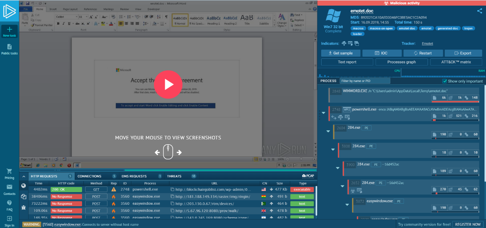

Note how the file is still identified only by its "Checksums":

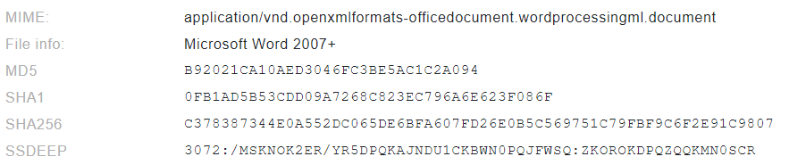    

If an analyst was to now search google with any of these checksums, the report generated by this sandboxing engine will now be provided as a listing for future analysts.

Proceeding to read through the report, interesting behaviours are summarised such as those below:

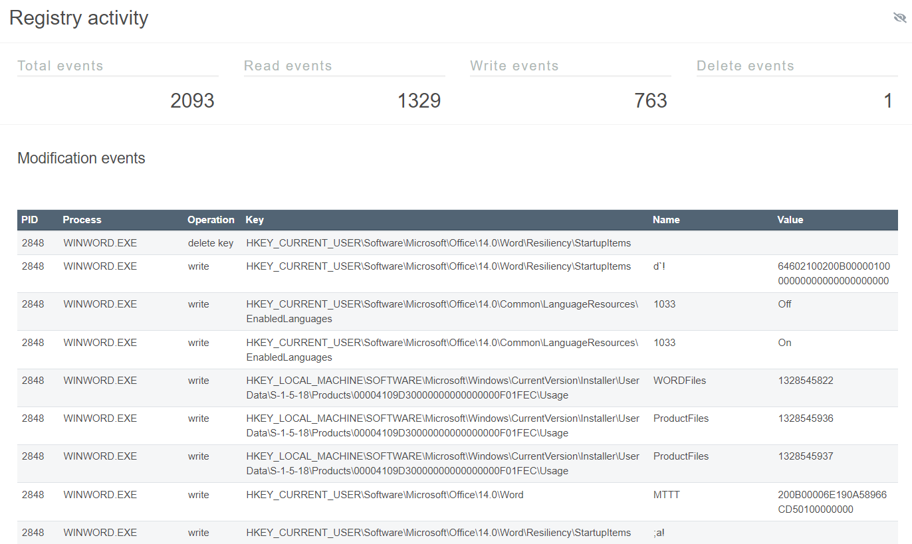

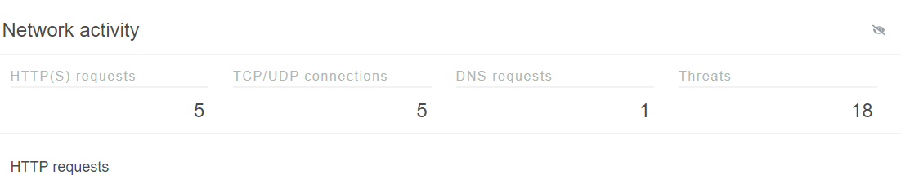

## Q & A

To answer the following questions, read through this analysed [sample](int-mal-sample.pdf) to solve the following questions:

Q1 Name the key term for the type of malware that Emotet is classified as

A1 Trojan

Q2 Research time! What type of emails does Emotet use as its payload?

A2 spam emails

Q3 Begin analysing the report, what is the timestamp of when the analysis was made?

A3 9/16/2019, 13:54:48

Q4 Name the file that is detected as a "Network Trojan"

A4 easywindow.exe

Q5 What is the PID of the first HTTP GET request?

A5 2748

Q6 What is the only DNS request that is made after the sample is executed?

A6 blockchainjoblist.com 

# Practical: Calculating & Reporting Checksums

## Calculating the MD5 Checksums of provided material:
You will be able to interact with your instance using the in-browser functionality, however, you may connect via RDP using the details below - ensuring you are connected to the TryHackMe VPN beforehand. 

IP Address: 10.201.76.127

Username: Administrator

Password: Tryhackme123!

I have provided the tools and materials on this Instance for you to complete the questions. I will go through obtaining the MD5 Checksum of a file using two methods - you will apply these techniques to answer the questions for this task.

The required material is located on the "Administrator" user's Desktop.

## Using the 3rd-party application "HashTab":

1. Right-click the file you wish to retrieve the checksum of. I will be using "ComplexCalculatorv2" in this example.

2. Left-click the "Properties" title in the drop-down.

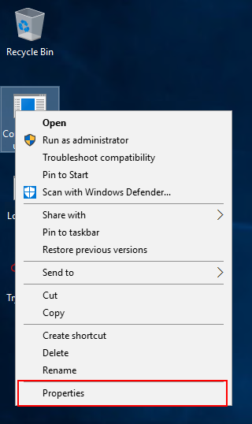

3. In the popup, navigate to the "File Hashes" tab, where you will see a screenshot akin to the one below. Note that this tab is not present on a default Windows installation:

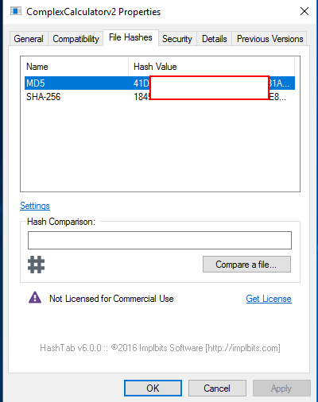

## Using Windows' "Powershell":

1. Firstly we will need to open up "Powershell". You can do this by opening the Windows Search bar.

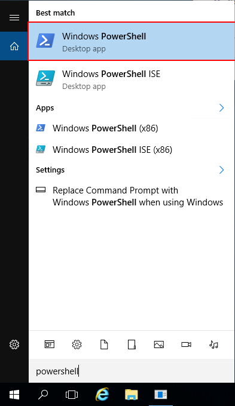

2. Next, change the directory of the users Desktop by using cd Desktop 

3. Verify you are in the right directory by using dir to list the files in the directory. You should see the three below:

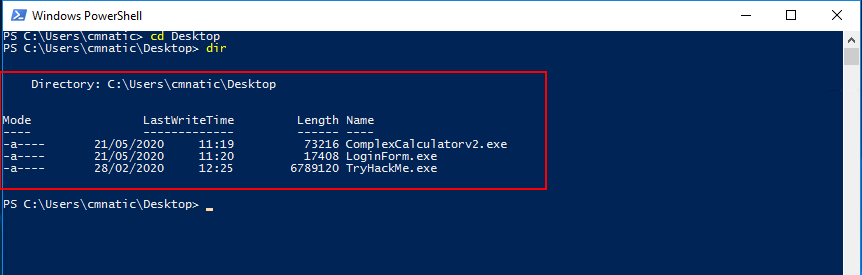

Powershell has both CertUtil and File-Hash commands that allow us to retrieve various checksums of files, including MD5, SHA1, SHA2, and SHA-256. I will detail the syntax for both below, calculating the MD5 checksum of a file.

## Using CertUtil:

`CertUtil -hashfile ComplexCalculatorv2.exe MD5|SHA256|SHA512` or `CertUtil -hashfile <filename> <algorithm>` such as in the example below:

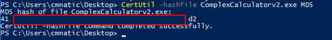

## Using FileHash:

`Get-FileHash file_name -Algorithm MD5|SHA256|SHA512`

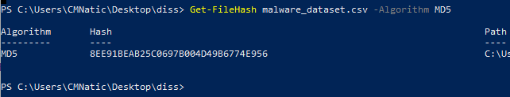

## Q & A

Q1 Using the HashTab tool, what is the MD5 checksum for "LoginForm.exe"?

A1 FF395A6D528DC5724BCDE9C844A0EE89

Q2 Using Get-FileHash in Powershell, retrieve the SHA256 of "TryHackMe.exe"

A2 6F870C80361062E8631282D31A16872835F7962222457730BC55676A61AD1EE0

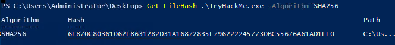

Q3 What would be the syntax to retrieve the SHA256 checksum of "TryHackMe.exe" using CertUtil in Powershell?

A3 CertUtil -hashfile TryHackMe.exe SHA256

# VirusTotal

Another online service that utilises these checksums is Virustotal. Virustotal acts as an indexer and aggregator for various Anti Virus (AV) engines. When a checksum is submitted to Virsutotal, fellow malware analysts can view the AV reports attributed to that file. 

Much like a search engine, you can search for reports by a few characteristics, for example:

-    The IP Addresses that samples communicate with
-    Checksums
-    The file itself

In the screenshot below, I have uploaded the "TryHackMe.exe" executable to Virustotal. If you were to browse to VirusTotal, you would be able to discover this report by entering the files' checksum. I have provided the report for you [here](https://www.virustotal.com/gui/file/6f870c80361062e8631282d31a16872835f7962222457730bc55676a61ad1ee0/details).

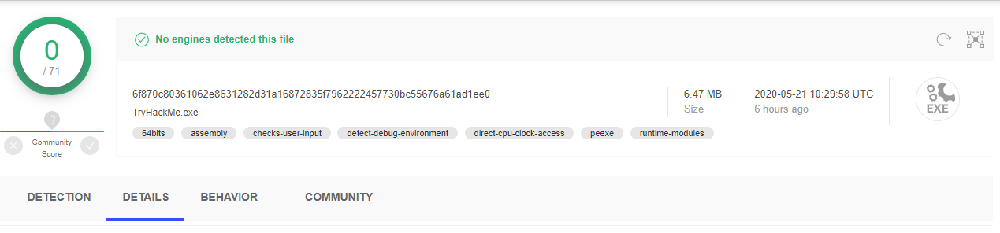

## Q & A

Q1 Navigate to the "Details" tab, what is the other filename and extension reported as present?

A1 HxD.exe

Q2 In the same "Details" tab, what is the reported compilation timestamp?

A2 2020-02-28 11:16:36

Q3 What is the THM{} formatted flag on the report?

A3 THM{TryHackMe_Malware_Series_Research_Flag}

# Future Reading (References)

### Cryptography and Checksums:

[A Meaningful MD5 Hash Collision Attack](https://scholarworks.sjsu.edu/cgi/viewcontent.cgi?referer=https://www.google.com/&httpsredir=1&article=1020&context=etd_projects) - (Narayana D. Kashyap., 2008)

[Cryptography & Network Security](https://dl.acm.org/doi/book/10.5555/1209579) - (Behrouz A. Forozuan., 2007)

[The first collision for full SHA-1](https://shattered.io/static/shattered.pdf) - (Stevens et al., 2017) / (Shattered.io)

### Blog (Selfless Promo)

[So you want to analyse malware?](https://blog.cmnatic.co.uk/posts/so-you-want-to-analyse-malware/)

### Sandboxing Engines:

any.run

hybrid-analysis
