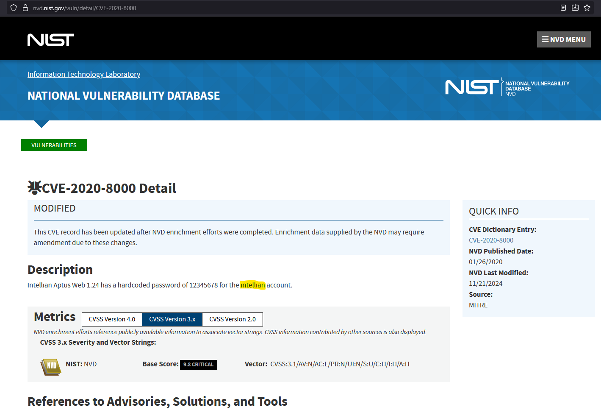
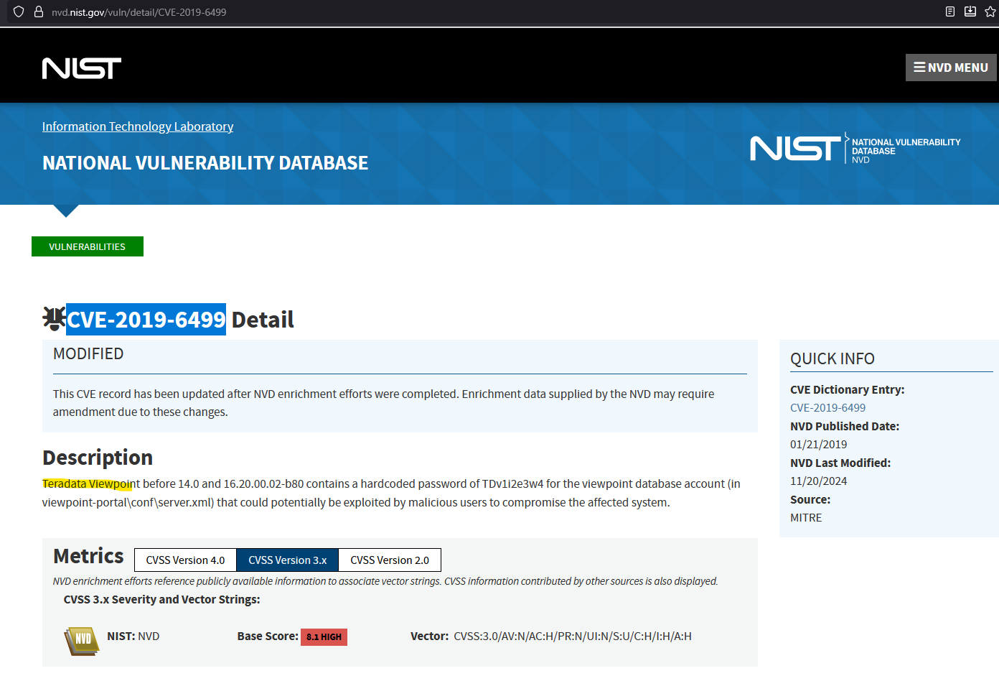
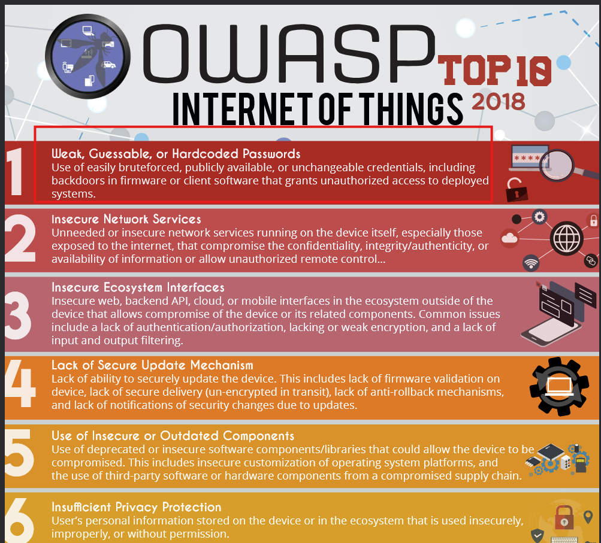
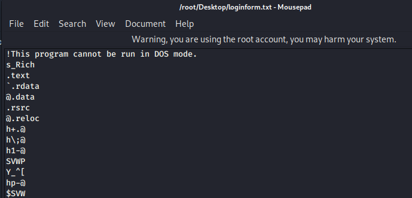
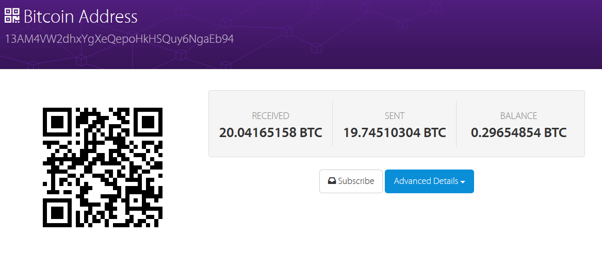
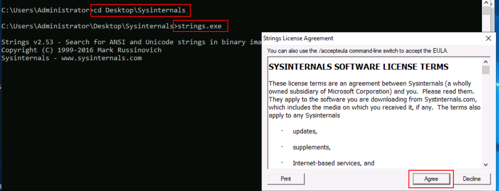
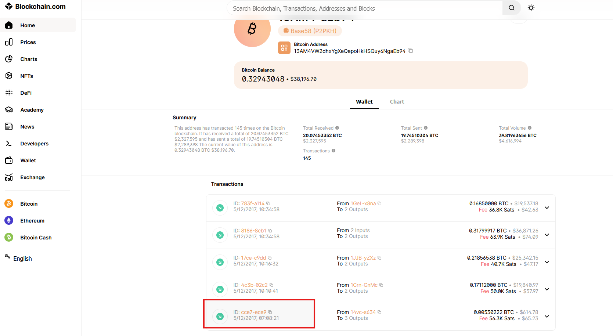
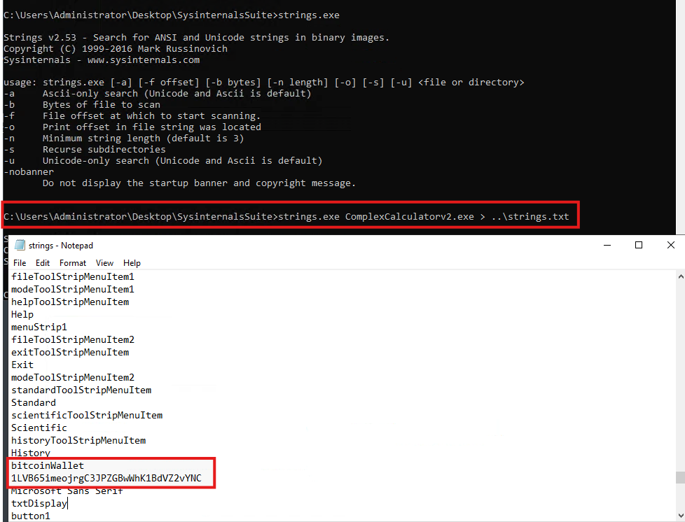

# What are strings

## What are "strings"?

From a programming perspective, "strings" is the term given for data handled by an application. At a broader view, these pieces of data are used to store information such as text to numerical values.

For example, let's say we have an application such as a calculator. A user will have to input two numerical values (e.g. 1 and 5) combined with an operator (e.g. + or plus) addition in this case. These values will be stored as "strings".

However "strings" can be stored within the application itself - where no input is necessary from the user. For example, using the example of usernames and passwords is a great representation of the many types of information that may be stored as a "string".

## Why are "strings" important?

We're all security-minded people here and know that writing down passwords isn't a very smart thing to do. However, developers are not quite so likeminded and often leave credentials in applications which are often essential i.e. An application that server needs to know the IP address of it. Arguably, an IP address is trivial in comparison to the sensitivity of a password - but both would be stored as strings.

There are a plethora of examples of companies storing sensitive information such as passwords within their applications. For example, [Intellian](https://www.intelliantech.com/), a satellite-communications focused company had the disclosure of their "Aptus Web 1.24" application retaining a default passcode of “12345678”.

Illustrated below is an example of an Android Application containing sensitive credentials within strings:

(Credit: Ezequiel., Skullarmy)

Time for a bit of [research](https://tryhackme.com/room/introtoresearch) to solve the questions below!

## Q & A

Q1 What is the name of the account that had the passcode of "12345678" in the intellian example discussed above?

A1  intellian

Q2 What is the CVE entry disclosed by the company "Teradata" in their "Viewpoint" Application that has a password within a string?

A2 CVE-2019-6499

Q3 According to OWASP's list of "Top Ten IoT" vulnerabilities, name the ranking this vulnerability would fall within, represented as text.

A3 one

# Practical: Extracting "strings" From an Application

Download the material attached to the task.

It is a little console program I have written in c++ for this example that replicates a login prompt. We will be using Kali Linux. You can use the one provided by TryHackMe for this task or your own.

As displayed above, if you were to execute this on Windows you'd be greeted with a prompt asking for a Username and password. The problem is, we don't know what the credentials are but we want to get in! Let's have a look into how the application understands what usernames and passwords are right and wrong.

Load up a terminal and use the command strings <filename>replacing <filename> with the name and path of the downloaded file attached to this Task i.e. strings /home/kali/Downloads/LoginForm.exe 

You will see a lot of text appear - and might be cut things out! Rather than just printing the output to the terminal, perhaps we should save it to a file? You can "pipe" (or direct) the output to a file

Now that we have stored the output into a file, we can do all sorts - filter it, sort it, search it! That's what you'll need to do. Open it in a text editor - either via terminal using nano, vi or Kali's installed GUI text editor Mousepad 

Looking through the file will show mostly garbage, but all you need is one golden nugget! You will be able to answer the following questions with this information. Think, what looks most likely a username and password?

## Q & A

Q1 What is the correct username required by the "LoginForm"?

A1 cmnatic

Q2 What is the required password to authenticate with?

A2 TryHackMeMerchWhen

Q3 What is the "hidden" THM{} flag?

A3 THM{Not_So_Hidden_Flag}

# Strings in the Context of Malware

Great, developers can be lazy - they leave passwords in applications as we have previously discussed. How does that relate to us as a malware analyst? Well...

We've discovered that even professional developers can "slip up" a few times, malware authors are still developers at the end of the day.

But more specifically, malware types such as botnets and ransomware rely upon information being stored within strings I.e. IP Addresses so that they are able to "call home" and connect to their "Command and Control" (C&C) server.

A famous example is the "Wannacry" ransomware. The "killswitch" was a domain that was discovered as a value contained within a string.

As we will later come on to discover, building a picture of the various stages a piece of malware proceeds through is essential to prevent further infection. Information such as who the software communicates to I.e. IP Addresses such as in the case of a botnet, or the payment address in the instances of ransomware is prevalent in building this picture.

## Q & A 

Q1 What is the key term to describe a server that Botnets recieve instructions from?

A1 Command and Control

Q2 Name the discussed example malware that uses "strings" to store the bitcoin wallet addresses for payment

A2 Wannacry

# Practical: Finding Bitcoin Addresses in Ransomware (Deploy!)

# Summary

## What is Bitcoin?

At a brief overview, Bitcoin is an "anonymous" online payment currency in the sense that there is no direct attribution between the sender and recipient. Authors of ransomware use this currency because of this trait - however, just because there is no attribution such as real names like traditional payment methods, it is traceable by Law Enforcement (albeit difficult).

For example, Wannacry uses Bitcoin as the payment method for the decryption of files. Bitcoin uses virtual wallets, similar to a MAC address of a network interface card. MuirlandOracle explains the concept of MAC addresses in his Introductory: Networking room, these wallets have addresses who are unique.

I.e. The Bitcoin address used by the authors of Wannacry was 13AM4VW2dhxYgXeQepoHkHSQuy6NgaEb94

In this case, the previously mentioned Bitcoin address used for Wannacry has to-date received over 20BTC (Bitcoins) from victims, which translates into over just over £158k (as of 06/04/2020).

You can use a website such as BlockCypher to explore the Bitcoin network and transactions between wallets.

## Practical

You need to perform a few prerequisites before you can complete this task, the steps are detailed below:

-    Deploy the VM attached to this room and wait a couple of minutes for it to deploy. In the interim, ensure you are connected to TryHackMe via OpenVPN to RDP into the machine using the details below, or alternatively, control the instance in-browser at the top of the web page!
-    Open the "Sysinternals" folder located on the Desktop to proceed

To login to the instance via RDP:

MACHINE_IP

Username: Administrator

Password: tryhackme123!

Domain: malstrings

Before using the "strings" tool provided with Sysinternals, we need to accept the license agreement first. You can do this by launching the executable through the command prompt and press "Agree" on the popup dialogue box.

With this license accepted, we can now use this tool to extract the "strings" contained within the ComplexCalculatorv2.exe with the following syntax: `strings.exe ComplexCalculatorv2.exe > strings.txt`

## Q & A

Q1 What was the date of the first transaction made in the [Bitcoin wallet](https://www.blockchain.com/explorer/addresses/btc/13AM4VW2dhxYgXeQepoHkHSQuy6NgaEb94) of the "WannaCry" developers?

The first transaction can be found on the last page of the list of transactions.

Answer format: MM/DD/YYYY

A1 05/12/2017

Q2 What is the Bitcoin Address stored within "ComplexCalculator.exe"

A2 1LVB65imeojrgC3JPZGBwWhK1BdVZ2vYNC

# Summary

## Let's Recap...

This room is somewhat arguably brief. However, we discussed the theory behind "strings" and why they are important for us as malware analysts. There isn't all that much to the actual process of extracting "strings", however, it is an important topic to discuss.

Moreover, hopefully after a bit of research, you now understand why "hard-coded" values such as credentials are a bad thing - and unfortunately still a re-occurring problem, least not an easy way to get into bug bounties!

We then extracted some of these "strings" from an example application that I made using Kali Linux's strings command. 

Whilst there isn't a default command to extract "strings" within a program on Windows, there's certainly a toolset that Microsoft provides that you can download!

Finally, we discussed how malware variants such as ransomware rely upon "strings" functionality i.e. "calling home" and/or bitcoin wallet addresses.

I hope you enjoyed the practical side and remember the tools available to you to extract these "strings" for use later on within the series!

~CMNatic

## Q & A

Q1 What is the name of the toolset provided by Microsoft that allows you to extract the "strings" of an application?

A1 Sysinternals

Q2 What operator would you use to "pipe" or store the output of the strings command?

A2 `>`

Q3 What is the name of the currency that ransomware often uses for payment?

A3 Bitcoin