# Objectives

Before completing this room, you should be aware of some fundamentals. For example, the differences between CMD, PS and some syntax. This room will cover the following:

-    What is Powershell
-    Basic Powershell commands
-    Windows enumeration skills
-    Powershell scripting


Username 	Administrator
Password 	BHN2UVw0Q
IP 	MACHINE_IP 

# What is Powershell?

Powershell is the Windows Scripting Language and shell environment built using the .NET framework.

This also allows Powershell to execute .NET functions directly from its shell. Most Powershell commands, called cmdlets, are written in .NET. Unlike other scripting languages and shell environments, the output of these cmdlets are objects - making Powershell somewhat object-oriented.

This also means that running cmdlets allows you to perform actions on the output object (which makes it convenient to pass output from one cmdlet to another). The normal format of a cmdlet is represented using Verb-Noun; for example, the cmdlet to list commands is called Get-Command
Common verbs to use include:

-    Get
-    Start
-    Stop 
-    Read
-    Write
-    New
-    Out

To get the complete list of approved verbs, visit this [link](https://docs.microsoft.com/en-us/powershell/scripting/developer/cmdlet/approved-verbs-for-windows-powershell-commands?view=powershell-7).

## Q & A

Q1 What is the command to get a new object?

A1 `Get-New`


# Basic Powershell Commands


Now that we've understood how cmdlets work - let's explore how to use them! The main thing to remember here is that `Get-Command` and `Get-Help` are your best friends! 

## Using Get-Help

`Get-Help` displays information about a cmdlet. To get help with a particular command, run the following:

`Get-Help Command-Name`

You can also understand how exactly to use the command by passing in the `-examples` flag. This would return output like the following: 

```powershell
           
PS C:\Users\Administrator> Get-Help Get-Command -Examples

NAME
    Get-Command

SYNOPSIS
Gets all commands.

Example 1: Get cmdlets, functions, and aliases

PS C:\>Get-Command

```
## Using Get-Command

`Get-Command` gets all the cmdlets installed on the current Computer. The great thing about this cmdlet is that it allows for pattern matching like the following

`Get-Command Verb-*` or `Get-Command *-Noun`

Running `Get-Command New-*` to view all the cmdlets for the verb new displays the following: 

```powershell

           
PS C:\Users\Administrator> Get-Command New-*

CommandType     Name                                               Version    Source
-----------     ----                                               -------    ------
Alias           New-AWSCredentials                                 3.3.563.1  AWSPowerShell
Alias           New-EC2FlowLogs                                    3.3.563.1  AWSPowerShell
Alias           New-EC2Hosts                                       3.3.563.1  AWSPowerShell
Alias           New-RSTags                                         3.3.563.1  AWSPowerShell
Alias           New-SGTapes                                        3.3.563.1  AWSPowerShell
Function        New-AutologgerConfig                               1.0.0.0    EventTracingManagement
Function        New-DAEntryPointTableItem                          1.0.0.0    DirectAccessClientComponents
Function        New-DscChecksum                                    1.1        PSDesiredStateConfiguration
Function        New-EapConfiguration                               2.0.0.0    VpnClient
Function        New-EtwTraceSession                                1.0.0.0    EventTracingManagement
Function        New-FileShare                                      2.0.0.0    Storage
Function        New-Fixture                                        3.4.0      Pester
Function        New-Guid                                           3.1.0.0    Microsoft.PowerShell.Utility
--cropped for brevity--

```

## Object Manipulation

In the previous task, we saw how the output of every cmdlet is an object. If we want to manipulate the output, we need to figure out a few things:

-    passing the output to other cmdlets
-    using specific object cmdlets to extract information

The Pipeline(`|`) is used to pass output from one cmdlet to another. A major difference compared to other shells is that Powershell passes an object to the next cmdlet instead of passing text or string to the command after the pipe. Like every object in object-oriented frameworks, an object will contain methods and properties.

`cmdlet | cmdlet` 

You can think of methods as functions that can be applied to output from the cmdlet, and you can think of properties as variables in the output from a cmdlet. 

An example of running this to view the members for Get-Command is:

`Get-Command | Get-Member -MemberType Method`

```powershell
PS C:\Users\Administrator> Get-Command | Get-Member -MemberType Method


   TypeName: System.Management.Automation.AliasInfo

Name             MemberType Definition
----             ---------- ----------
Equals           Method     bool Equals(System.Object obj)
GetHashCode      Method     int GetHashCode()
GetType          Method     type GetType()
ResolveParameter Method     System.Management.Automation.ParameterMetadata ResolveParameter(string name)
ToString         Method     string ToString()


   TypeName: System.Management.Automation.FunctionInfo

Name             MemberType Definition
----             ---------- ----------
Equals           Method     bool Equals(System.Object obj)
GetHashCode      Method     int GetHashCode()
GetType          Method     type GetType()
ResolveParameter Method     System.Management.Automation.ParameterMetadata ResolveParameter(string name)
ToString         Method     string ToString()


   TypeName: System.Management.Automation.CmdletInfo

Name             MemberType Definition
----             ---------- ----------
Equals           Method     bool Equals(System.Object obj)
GetHashCode      Method     int GetHashCode()
GetType          Method     type GetType()
ResolveParameter Method     System.Management.Automation.ParameterMetadata ResolveParameter(string name)
ToString         Method     string ToString()


PS C:\Users\Administrator>
```
From the above flag in the command, you can see that you can also select between methods and properties.

## Creating Objects From Previous cmdlets

One way of manipulating objects is pulling out the properties from the output of a cmdlet and creating a new object. This is done using the `Select-Object` cmdlet. 

Here's an example of listing the directories and just selecting the mode and the name:

```powershell

PS C:\Users\Administrator> Get-ChildItem | Select-Object -Property Mode, Name
Mode   Name
----   ----
d-r--- Contacts
d-r--- Desktop
d-r--- Documents
d-r--- Downloads
d-r--- Favorites
d-r--- Links
d-r--- Music
d-r--- Pictures
d-r--- Saved Games
d-r--- Searches
d-r--- Videos

PS C:\Users\Administrator>
```

Here's how it would look without the `Select-Object` cmdlet:
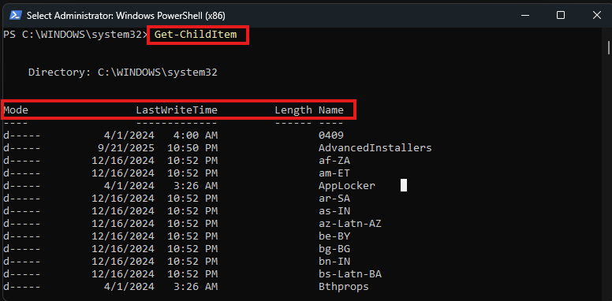

You can also use the following flags to select particular information:

-    `-First` - gets the first x object
-    `-Last` - gets the last x object
-    `-Unique` - shows the unique objects
-    `-Skip` - skips x objects

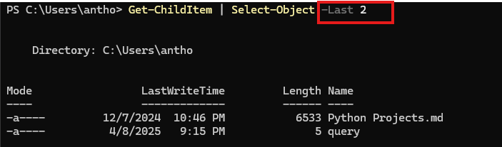

## Filtering Objects

When retrieving output objects, you may want to select objects that match a very specific value. You can do this using the `Where-Object` to filter based on the value of properties. 

The general format for using this cmdlet is 

`<cmdlet> | Where-Object -Property <PropertyName> -<operator> <Value>`

`<cmdlet> | Where-Object {$_.<PropertyName> -<operator> <Value>}`

The second version uses the `$_` operator to iterate through every object passed to the Where-Object cmdlet.

Powershell is quite sensitive, so don't put quotes around the command!

Where `-<operator>` is a list of the following operators:

-    `-Contains`: if any item in the property value is an exact match for the specified value
-    `-EQ`: if the property value is the same as the specified value
-    `-GT`: if the property value is greater than the specified value

For a full list of operators, use this [link](https://learn.microsoft.com/en-us/powershell/module/microsoft.powershell.core/where-object?view=powershell-7.5&viewFallbackFrom=powershell-6).

Here's an example of checking the stopped processes:

```powershell
           
PS C:\Users\Administrator> Get-Service | Where-Object -Property Status -eq Stopped

Status   Name               DisplayName
------   ----               -----------
Stopped  AJRouter           AllJoyn Router Service
Stopped  ALG                Application Layer Gateway Service
Stopped  AppIDSvc           Application Identity
Stopped  AppMgmt            Application Management
Stopped  AppReadiness       App Readiness
Stopped  AppVClient         Microsoft App-V Client
Stopped  AppXSvc            AppX Deployment Service (AppXSVC)
Stopped  AudioEndpointBu... Windows Audio Endpoint Builder
Stopped  Audiosrv           Windows Audio
Stopped  AxInstSV           ActiveX Installer (AxInstSV)
Stopped  BITS               Background Intelligent Transfer Ser...
Stopped  Browser            Computer Browser
Stopped  bthserv            Bluetooth Support Service
-- cropped for brevity--

```

## Sort-Object

When a cmdlet outputs a lot of information, you may need to sort it to extract the information more efficiently. You do this by pipe-lining the output of a cmdlet to the Sort-Object cmdlet.

The format of the command would be:

`<cmdlet> | Sort-Object`

Here's an example of sorting the list of directories:

```powershell

PS C:\Users\Administrator> Get-ChildItem | Sort-Object
    Directory: C:\Users\Administrator
Mode                LastWriteTime         Length Name
----                -------------         ------ ----
d-r---        10/3/2019   5:11 PM                Contacts
d-r---        10/5/2019   2:38 PM                Desktop
d-r---        10/3/2019  10:55 PM                Documents
d-r---        10/3/2019  11:51 PM                Downloads
d-r---        10/3/2019   5:11 PM                Favorites
d-r---        10/3/2019   5:11 PM                Links
d-r---        10/3/2019   5:11 PM                Music
d-r---        10/3/2019   5:11 PM                Pictures
d-r---        10/3/2019   5:11 PM                Saved Games
d-r---        10/3/2019   5:11 PM                Searches
d-r---        10/3/2019   5:11 PM                Videos
PS C:\Users\Administrator>
```


## Q & A

Q1 What is the location of the file "interesting-file.txt"

A1 C:\Program Files

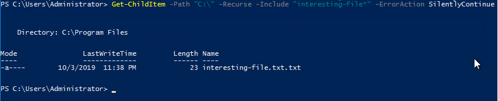

Used the:

- `-Recurse` flag to go through each child directory's child directory ...
- `-Include` flag after trying `-Filter` because as you can see the name ends in `txt.txt` so it didnt find an exact match with "interesting-file.txt"
- `-ErrorAction SilentlyContinue` to keep going through the directories and after running into file permission errors

#
Q2 Specify the contents of this file

A2 notsointerestingcontent

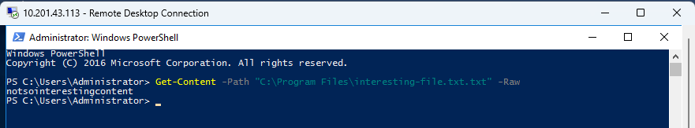

To read a file in PowerShell, the most common cmdlet is `Get-Content`. It reads the content of a file and returns it as an array of strings, one per line, or as a single string depending on the parameters used.

### Correct Syntax for `Get-Content`
```powershell
Get-Content [-Path] <String[]> [-ReadCount <Int64>] [-TotalCount <Int64>] [-Raw] [<CommonParameters>]
```

### Key Parameters
- `-Path <String[]>`: Specifies the file path(s) to read. This is the primary parameter (can also use `-LiteralPath` for exact paths).
- `-Raw`: Reads the file as a single string instead of an array of lines.
- `-TotalCount <Int64>`: Reads only the first *n* lines of the file.
- `-ReadCount <Int64>`: Specifies how many lines to read at a time (affects processing speed for large files).
- `<CommonParameters>`: Includes `-Verbose`, `-Debug`, etc.

### Example Usage
1. Read an entire text file:
   ```powershell
   Get-Content -Path "C:\Path\To\File.txt"
   ```
   Outputs each line of `File.txt` as an array of strings.

2. Read file as a single string:
   ```powershell
   Get-Content -Path "C:\Path\To\File.txt" -Raw
   ```
   Returns the file content as one continuous string.

3. Read only the first 10 lines:
   ```powershell
   Get-Content -Path "C:\Path\To\File.txt" -TotalCount 10
   ```
   Outputs the first 10 lines of the file.

4. Read multiple files:
   ```powershell
   Get-Content -Path "C:\Path\*.txt"
   ```
   Reads all `.txt` files in the specified directory.

### Notes
- Use `-Encoding` (e.g., `-Encoding UTF8`) if you need to specify the file’s character encoding (e.g., for non-ASCII files).
- For large files, `-Raw` or `-ReadCount` can improve performance.
- If the file is locked or inaccessible, you may need to run PowerShell as an administrator or check file permissions.


#
Q3 How many cmdlets are installed on the system(only cmdlets, not functions and aliases)?

A3 6638

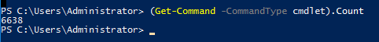

or

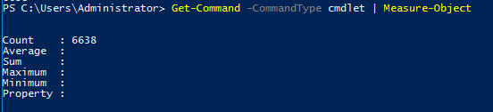

To find the number of PowerShell cmdlets installed on your system, you can use the `Get-Command` cmdlet with the `-CommandType Cmdlet` parameter to list all cmdlets and then count them.

### Command to Count Installed Cmdlets
```powershell
(Get-Command -CommandType Cmdlet).Count
```

### Explanation
- `Get-Command`: Retrieves all commands available in the current PowerShell session.
- `-CommandType Cmdlet`: Filters the results to only include cmdlets (excludes aliases, functions, etc.).
- `.Count`: Returns the total number of cmdlets in the resulting collection.

### Example Output
Running the above command might output a number like `1500` (the exact number depends on the PowerShell version, installed modules, and system configuration).

### Additional Details
- Scope: This counts cmdlets available in the current session, including those from imported modules. To include additional modules, use `Import-Module` first (e.g., `Import-Module ActiveDirectory` for AD cmdlets).
- All Modules: To count cmdlets from all available modules (even those not imported), use:
  ```powershell
  (Get-Command -CommandType Cmdlet -ListImported:$false).Count
  ```
- Specific Module: To count cmdlets in a specific module (e.g., `Microsoft.PowerShell.Utility`):
  ```powershell
  (Get-Command -Module Microsoft.PowerShell.Utility -CommandType Cmdlet).Count
  ```

### Notes
- The number of cmdlets varies based on your PowerShell version (e.g., PowerShell 5.1 vs. 7.x) and installed modules.
- Run PowerShell as an administrator to ensure access to all cmdlets, especially for system-level modules.
- To list all cmdlets (not just count them), omit `.Count`:
  ```powershell
  Get-Command -CommandType Cmdlet
  ```


#
Q4 Get the MD5 hash of interesting-file.txt

A4 49A586A2A9456226F8A1B4CEC6FAB329

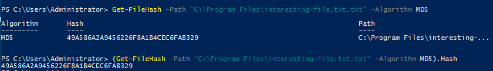

To get the MD5 hash of a text file in PowerShell, you can use the `Get-FileHash` cmdlet, which computes the hash of a file using a specified algorithm, such as MD5.

### Command to Get MD5 Hash of a Text File
```powershell
Get-FileHash -Path "C:\Path\To\YourFile.txt" -Algorithm MD5
```

### Explanation
- `-Path`: Specifies the path to the text file (replace `"C:\Path\To\YourFile.txt"` with the actual file path).
- `-Algorithm MD5`: Specifies the MD5 hashing algorithm. Other options include SHA1, SHA256, etc.
- Output: Returns an object with the hash value (in hexadecimal) and other properties like the algorithm and file path.

### Example Usage
```powershell
Get-FileHash -Path "C:\Users\Documents\example.txt" -Algorithm MD5
```

Sample Output:
```
Algorithm       Hash                                                                    Path
---------       ----                                                                    ----
MD5             D41D8CD98F00B204E9800998ECF8427E                                        C:\Users\Documents\example.txt
```
The `Hash` property contains the MD5 hash of the file.

### Notes
- File Access: Ensure the file exists and is accessible. If it’s locked or you lack permissions, run PowerShell as an administrator.
- Case Sensitivity: The MD5 hash is typically displayed in uppercase, but it’s case-insensitive for comparison.
- Alternative: If you only want the hash value (without headers), use:
  ```powershell
  (Get-FileHash -Path "C:\Path\To\YourFile.txt" -Algorithm MD5).Hash
  ```
  This outputs just the hash, e.g., `D41D8CD98F00B204E9800998ECF8427E`.


#
Q5 What is the command to get the current working directory?

A5 Get-Location

To get the current working directory in PowerShell, use the `Get-Location` cmdlet (aliased as `pwd`).

### Command
```powershell
Get-Location
```

### Example Output
```
Path
----
C:\Users\Username\Documents
```

### Notes
- Alias: You can also use `pwd` for brevity:
  ```powershell
  pwd
  ```
- Output: Returns a `PathInfo` object. To get just the path as a string, use:
  ```powershell
  (Get-Location).Path
  ```
  Output: `C:\Users\Username\Documents`
- Context: The current working directory is the folder PowerShell is operating in for commands like `Get-ChildItem` or file operations.


#
Q6 Does the path "C:\Users\Administrator\Documents\Passwords" Exist (Y/N)?

A6 N

To check if a path (file or directory) exists in PowerShell, you can use the `Test-Path` cmdlet. It returns `$true` if the path exists and `$false` if it doesn’t.

### Command to Check if a Path Exists
```powershell
Test-Path -Path "C:\Path\To\Check"
```

### Explanation
- `-Path <String>`: Specifies the path to check (file or directory). Replace `"C:\Path\To\Check"` with the actual path.
- Output: Returns a boolean (`$true` or `$false`).

### Example Usage
1. Check if a file exists:
   ```powershell
   Test-Path -Path "C:\Users\Documents\example.txt"
   ```
   Output: `$true` if `example.txt` exists, `$false` otherwise.

2. Check if a directory exists:
   ```powershell
   Test-Path -Path "C:\Users\Documents"
   ```
   Output: `$true` if the directory exists, `$false` otherwise.

3. Check for specific path type (file or directory):
   ```powershell
   Test-Path -Path "C:\Users\Documents\example.txt" -PathType Leaf
   ```
   `-PathType Leaf` checks for a file. Use `-PathType Container` for directories.

4. Use in a conditional statement:
   ```powershell
   if (Test-Path -Path "C:\Users\Documents\example.txt") {
       Write-Output "File exists!"
   } else {
       Write-Output "File does not exist."
   }
   ```

### Notes
- Wildcards: `Test-Path` supports wildcards (e.g., `Test-Path -Path "C:\Users\*.txt"`).
- Permissions: If you lack access to the path, `Test-Path` may return `$false` even if the path exists. Run PowerShell as an administrator if needed.
- Multiple Paths: You can check multiple paths by passing an array:
  ```powershell
  Test-Path -Path "C:\Path1", "C:\Path2"
  ```
- Literal Paths: Use `-LiteralPath` instead of `-Path` if the path contains special characters (e.g., square brackets).

#
Q7 What command would you use to make a request to a web server?

A7 `Invoke-WebRequest`


To make a request to a web server in PowerShell, the primary cmdlet is `Invoke-WebRequest` (aliased as `curl` or `iwr`). It sends HTTP/HTTPS requests to a web server and retrieves the response, including content, headers, and status codes.

### Correct Syntax for `Invoke-WebRequest`
```powershell
Invoke-WebRequest [-Uri] <Uri> [-Method <String>] [-Headers <IDictionary>] [-Body <Object>] [-ContentType <String>] [-UseBasicParsing] [<CommonParameters>]
```

### Key Parameters
- `-Uri <Uri>`: Specifies the URL of the web server (e.g., `https://api.example.com`). Required.
- `-Method <String>`: Specifies the HTTP method (e.g., `GET`, `POST`, `PUT`, `DELETE`). Default is `GET`.
- `-Headers <IDictionary>`: Specifies custom headers (e.g., for authentication or content type).
- `-Body <Object>`: Specifies the request body (e.g., for `POST` or `PUT` requests).
- `-ContentType <String>`: Sets the content type of the request (e.g., `application/json`).
- `-UseBasicParsing`: Uses basic parsing for faster processing (avoids DOM parsing, recommended for simple requests).

### Example Usage
1. Send a simple GET request:
   ```powershell
   Invoke-WebRequest -Uri "https://api.example.com"
   ```
   Returns a response object containing the content, status code, headers, etc.

2. Get only the content of a webpage:
   ```powershell
   (Invoke-WebRequest -Uri "https://www.example.com").Content
   ```
   Outputs the raw HTML content.


#
Q8 Base64 decode the file b64.txt on Windows. 

A8 ihopeyoudidthisonwindows

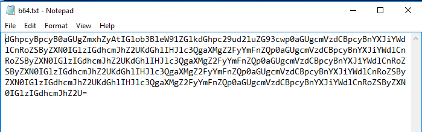

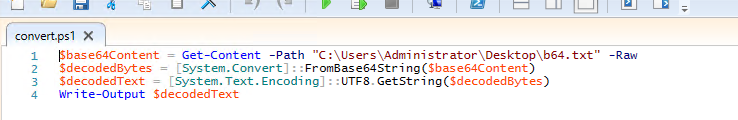

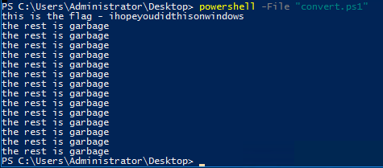


To Base64 decode the contents of a text file in PowerShell, you can use the `Get-Content` cmdlet to read the file and the `[System.Convert]::FromBase64String()` method to decode the Base64 content. Here's how to do it.

### Command to Base64 Decode a Text File
```powershell
$base64Content = Get-Content -Path "C:\Path\To\YourFile.txt" -Raw
$decodedBytes = [System.Convert]::FromBase64String($base64Content)
$decodedText = [System.Text.Encoding]::UTF8.GetString($decodedBytes)
Write-Output $decodedText
```

### Explanation
- `Get-Content -Path "C:\Path\To\YourFile.txt" -Raw`: Reads the file as a single string ( `-Raw` ensures no line splitting). Replace `"C:\Path\To\YourFile.txt"` with the actual file path.
- `[System.Convert]::FromBase64String($base64Content)`: Converts the Base64 string to a byte array.
- `[System.Text.Encoding]::UTF8.GetString($decodedBytes)`: Converts the byte array to a UTF-8 string (use `ASCII`, `Unicode`, or another encoding if needed).
- `Write-Output`: Displays the decoded text. You can redirect it to a file or variable if desired.

### Example Usage
Assume `C:\Users\Documents\encoded.txt` contains the Base64 string `SGVsbG8gV29ybGQ=` (which decodes to `Hello World`).

```powershell
$base64Content = Get-Content -Path "C:\Users\Documents\encoded.txt" -Raw
$decodedBytes = [System.Convert]::FromBase64String($base64Content)
$decodedText = [System.Text.Encoding]::UTF8.GetString($decodedBytes)
Write-Output $decodedText
```

Output:
```
Hello World
```

### Save Decoded Output to a New File
To save the decoded content to a new file (e.g., `decoded.txt`):
```powershell
$base64Content = Get-Content -Path "C:\Users\Documents\encoded.txt" -Raw
$decodedBytes = [System.Convert]::FromBase64String($base64Content)
$decodedText = [System.Text.Encoding]::UTF8.GetString($decodedBytes)
Set-Content -Path "C:\Users\Documents\decoded.txt" -Value $decodedText
```

### Notes
- Error Handling: Base64 strings must be valid (proper padding with `=` if needed). Use `try`/`catch` to handle errors:
  ```powershell
  try {
      $base64Content = Get-Content -Path "C:\Path\To\YourFile.txt" -Raw
      $decodedBytes = [System.Convert]::FromBase64String($base64Content)
      $decodedText = [System.Text.Encoding]::UTF8.GetString($decodedBytes)
      Write-Output $decodedText
  } catch {
      Write-Output "Error decoding Base64: $_"
  }
  ```
- Encoding: If the original content isn’t UTF-8, adjust the encoding (e.g., `[System.Text.Encoding]::ASCII`).
- File Path: Ensure the file exists (`Test-Path`) and you have read permissions. Run PowerShell as administrator if access is denied.
- Non-Text Files: If the Base64 string represents a binary file (e.g., an image), save the `$decodedBytes` directly using:
  ```powershell
  [System.IO.File]::WriteAllBytes("C:\Path\To\Output.bin", $decodedBytes)
  ```


# Enumeration


The first step when you have gained initial access to any machine would be to enumerate. We'll be enumerating the following:

-    users
-    basic networking information
-    file permissions
-    registry permissions
-    scheduled and running tasks
-    insecure files

Your task will be to answer the following questions to enumerate the machine using Powershell commands! 


## Q & A

Q1 How many users are there on the machine?

A1 5

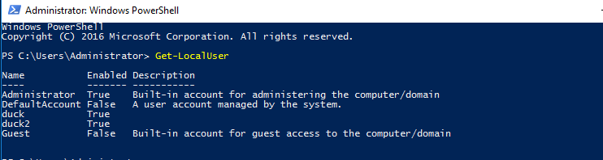

To list users in PowerShell, you can use various commands depending on what type of users you want to list (e.g., local users, Active Directory users, or users on a specific system). Below are the most common methods with concise explanations and examples:

### 1. List Local Users on a Windows Machine
Use the `Get-LocalUser` cmdlet to retrieve local user accounts on the system.

```powershell
Get-LocalUser
```

Details:
- This lists all local user accounts with properties like `Name`, `Enabled`, `Description`, etc.
- To filter or format, use `Select-Object` or `Where-Object`. For example:
  ```powershell
  Get-LocalUser | Select-Object Name, Enabled, LastLogon
  ```
  This shows only the `Name`, `Enabled` status, and `LastLogon` time.

### 2. List Active Directory Users (Domain Users)
If you're working in an Active Directory (AD) environment, use the `Get-ADUser` cmdlet from the Active Directory module.

```powershell
Get-ADUser -Filter *
```

Details:
- Requires the Active Directory module (`Install-WindowsFeature RSAT-AD-PowerShell` if not installed).
- The `-Filter *` retrieves all AD users. You can filter specific users, e.g.:
  ```powershell
  Get-ADUser -Filter {Enabled -eq $true} | Select-Object Name, SamAccountName, UserPrincipalName
  ```
  This lists only enabled AD users with their names, account names, and UPNs.
- To limit properties or search for specific users:
  ```powershell
  Get-ADUser -Filter {Name -like "John*"} | Select-Object Name, DistinguishedName
  ```

### 3. List Users Currently Logged into a Machine
To see users currently logged into the local or remote machine, use `quser` or `Get-CimInstance`.

```powershell
quser
```

Or:
```powershell
Get-CimInstance -ClassName Win32_LoggedOnUser | Select-Object -Unique Antecedent
```

Details:
- `quser` displays active sessions with usernames, session IDs, and logon times.
- `Get-CimInstance` retrieves logged-on users but requires parsing to extract usernames.
- For a remote computer:
  ```powershell
  quser /server:RemoteComputerName
  ```

### 4. List Users in a Specific Group
To list users in a local or AD group:

- Local Group (e.g., Administrators):
  ```powershell
  Get-LocalGroupMember -Group "Administrators"
  ```

- AD Group:
  ```powershell
  Get-ADGroupMember -Identity "GroupName" | Select-Object Name, SamAccountName
  ```

Details:
- Replace `"Administrators"` or `"GroupName"` with the target group.
- For AD, ensure the Active Directory module is available.

### 5. List User Profiles on a Machine
To list user profiles (e.g., folders in `C:\Users`), use `Get-WmiObject` or `Get-CimInstance`:

```powershell
Get-WmiObject -Class Win32_UserProfile | Select-Object LocalPath, SID
```

Details:
- Shows user profile paths and SIDs.
- Filter out system accounts:
  ```powershell
  Get-WmiObject -Class Win32_UserProfile | Where-Object { $_.Special -eq $false } | Select-Object LocalPath
  ```

### Notes:
- Permissions: Some commands (e.g., `Get-ADUser`, `Get-LocalGroupMember`) may require administrative privileges.
- Formatting Output: Use `Format-Table`, `Format-List`, or `Export-Csv` for better readability or to save results:
  ```powershell
  Get-LocalUser | Export-Csv -Path "Users.csv" -NoTypeInformation
  ```
- Remote Machines: For remote systems, use the `-ComputerName` parameter (if supported) or `Invoke-Command`:
  ```powershell
  Invoke-Command -ComputerName RemotePC -ScriptBlock { Get-LocalUser }
  ```

### Example: Comprehensive Local User List
```powershell
Get-LocalUser | Select-Object Name, Enabled, Description, LastLogon | Format-Table -AutoSize
```

### Example: Export AD Users to CSV
```powershell
Get-ADUser -Filter * -Properties Name, SamAccountName, EmailAddress | Select-Object Name, SamAccountName, EmailAddress | Export-Csv -Path "ADUsers.csv" -NoTypeInformation
```


#
Q2 Which local user does this SID(S-1-5-21-1394777289-3961777894-1791813945-501) belong to?

A2 Guest

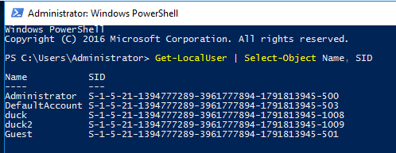

#
Q3 How many users have their password required values set to False?

A3 4

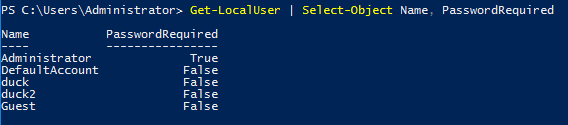

#
Q4 How many local groups exist?

A4 24

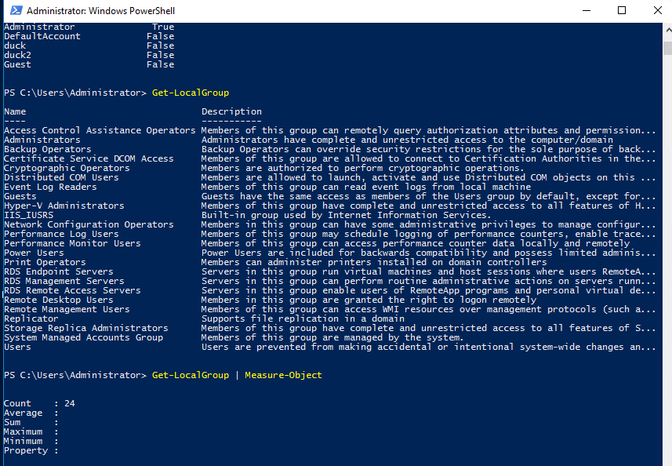

#
Q5 What command did you use to get the IP address info?

A5 Get-NetIPAddress

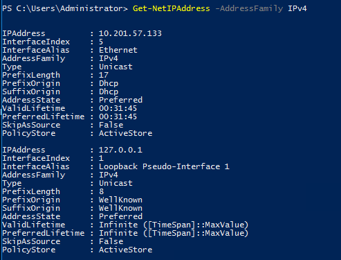

#
Q6 How many ports are listed as listening?

A6 20

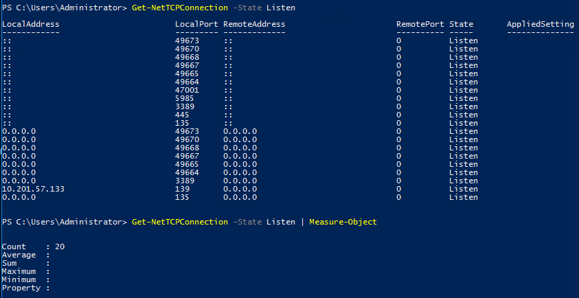

#
Q7 What is the remote address of the local port listening on port 445?

A7 ::

#
Q8 How many patches have been applied?

A8 20

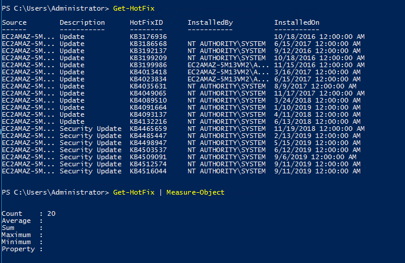

#
Q9 When was the patch with ID KB4023834 installed?

A9 6/15/2017 12:00:00 AM

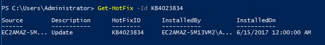

#
Q10 Find the contents of a backup file.

A10 backpassflag

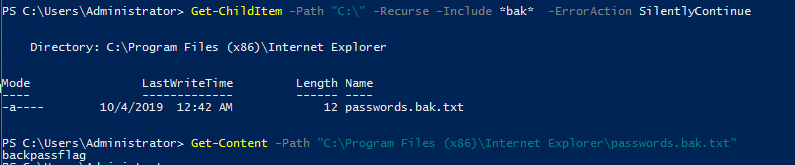

#
Q11 Search for all files containing API_KEY

A11 fakekey123


(...)

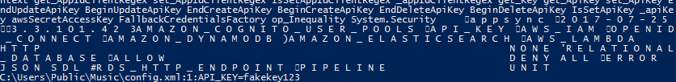


The `Select-String` cmdlet in PowerShell is used to search for text patterns in strings or files, similar to the `grep` command in Linux. When you use `Select-String -Pattern "API_KEY"`, you’re instructing PowerShell to search for the string "API_KEY" in the input data, which could be files, strings, or piped input. 

### How It Works
- Input: `Select-String` can search:
  - Files (e.g., `.txt`, `.ps1`, `.config`, `.log`) by specifying a file path.
  - Strings or objects piped into the cmdlet.
- Search Behavior:
  - By default, the search is case-insensitive.
  - It scans each line of the input for the pattern and returns matches with context (file name, line number, and the matching line).
- Output: For each match, it returns:
  - Filename: The file where the match was found (if searching files).
  - LineNumber: The line number in the file.
  - Line: The full text of the line containing the match.
  - Matches: The specific text that matched the pattern.

### Example Scenarios
#### 1. Search for "API_KEY" in a Single File
To search for "API_KEY" in a configuration file (e.g., `config.txt`):
```powershell
Select-String -Pattern "API_KEY" -Path "C:\Config\config.txt"
```
#### 2. Search in Multiple Files
To search all `.txt` and `.config` files in a directory:
```powershell
Get-ChildItem -Path "C:\Configs" -Recurse -Include *.txt,*.config | Select-String -Pattern "API_KEY"
```
- Explanation: `Get-ChildItem` retrieves all `.txt` and `.config` files recursively, and `Select-String` searches each for "API_KEY".


#
Q12 What command do you do to list all the running processes?

A12 Get-Process

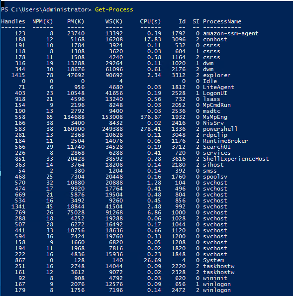

#
Q13 What is the path of the scheduled task called new-sched-task?

A13 /

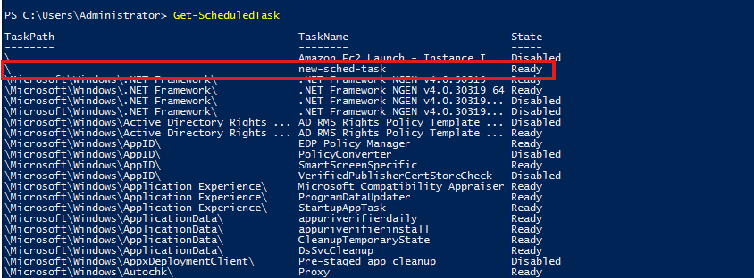

#
Q14 Who is the owner of the C:\

A14 NT SERVICE\TrustedInstaller

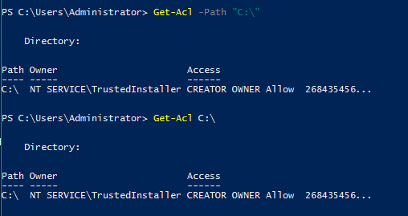

To check file ownership in PowerShell, you can use the `Get-Acl` cmdlet, which retrieves the Access Control List (ACL) for a file or folder, including the owner.

Example:
`Get-Acl -Path "C:\Path\To\File.txt" | Select-Object Owner`

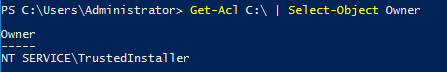


# Basic Scripting Challenge

Now that we have run Powershell commands, let's try to write and run a script to do more complex and powerful actions. 

For this ask, we'll use Powershell ISE (the Powershell Text Editor). Let's use a particular scenario to show an example of this script. Given a list of port numbers, we want to use this list to see if the local port is listening. Open the listening-ports.ps1 script on the Desktop using Powershell ISE. Powershell scripts usually have the .ps1 file extension. 

```powershell
$system_ports = Get-NetTCPConnection -State Listen

$text_port = Get-Content -Path C:\Users\Administrator\Desktop\ports.txt

foreach($port in $text_port){

    if($port -in $system_ports.LocalPort){
        echo $port
     }

}
```

On the first line, we want to get a list of all the ports on the system that are listening. We do this using the `Get-NetTCPConnection` cmdlet. We are then saving the output of this cmdlet into a variable. The convention to create variables is used as:

```powershell
$variable_name = value
```

In the following line, we want to read a list of ports from the file. We do this using the `Get-Content` cmdlet. Again, we store this output in the variables. The simplest next step is to iterate through all the ports in the file to see if the ports are listening. To iterate through the ports in the file, we use the following:

```powershell
foreach($new_var in $existing_var){}
```

This particular code block is used to loop through a set of objects. Once we have each individual port, we want to check if this port occurs in the listening local ports. Instead of doing another for loop, we just use an if statement with the `-in` operator to check if the port exists in the `LocalPort` property of any object. A full list of if statement comparison operators can be found [here](https://docs.microsoft.com/en-us/powershell/module/microsoft.powershell.core/about/about_comparison_operators?view=powershell-6). To run the script, call the script path using Powershell or click the green button on Powershell ISE:

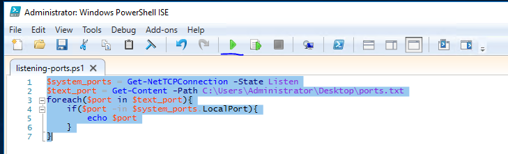

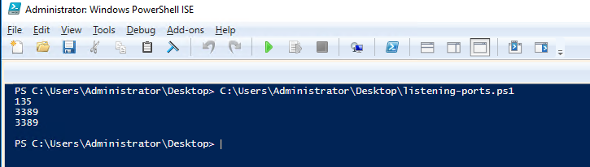

Scripting may be a bit difficult, but [here](https://learnxinyminutes.com/powershell/) is a good resource to use.

Now that we've seen what a basic script looks like - it's time to write one of your own. The emails folder on the Desktop contains copies of the emails John, Martha, and Mary have been sending to each other(and themselves). Answer the following questions with regard to these emails (try not to open the files and use a script to answer the questions). 

## Q & A

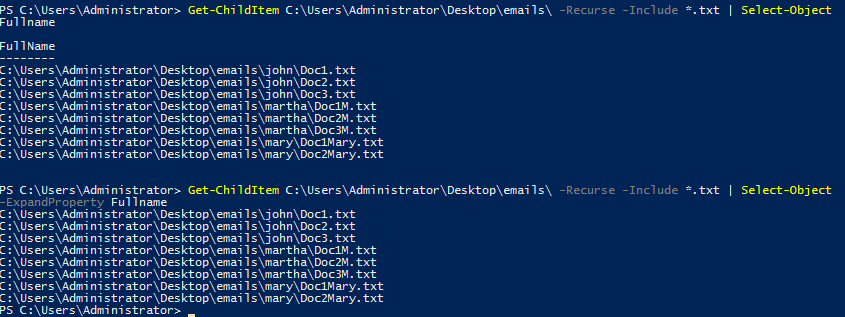

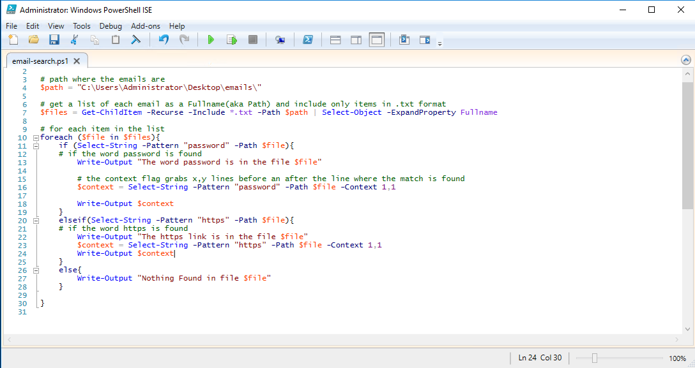

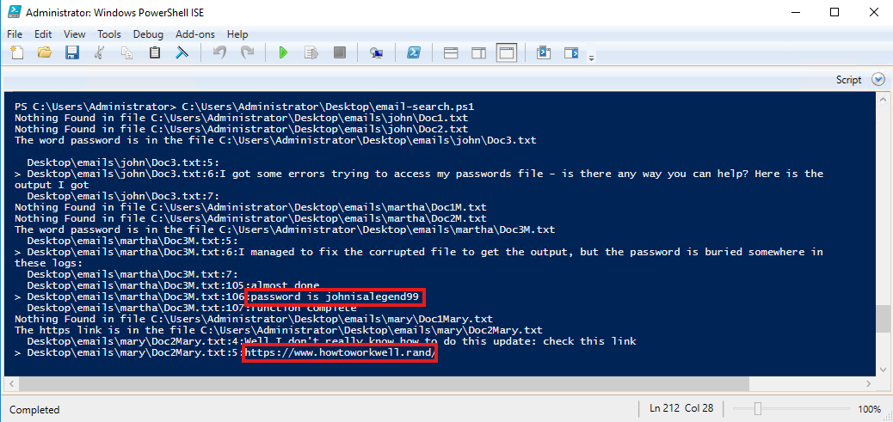

```powershell
# path where the emails are
$path = "C:\Users\Administrator\Desktop\emails\"

# get a list of each email as a Fullname(aka Path) and include only items in txt format
$files = Get-ChildItem -Recurse -Include *.txt -Path $path | Select-Object -ExpandProperty Fullname

# for each item in the list
foreach ($file in $files){
    if (Select-String -Pattern "password" -Path $file){
    # if the word password is found
        Write-Output "The word password is in the file $file"

        # the context flag grabs x,y lines before an after the line where the match is found
        $context = Select-String -Pattern "password" -Path $file -Context 1,1

        Write-Output $context
    }
    elseif(Select-String -Pattern "https" -Path $file){
    # if the word https is found
        Write-Output "The https link is in the file $file"
        $context = Select-String -Pattern "https" -Path $file -Context 1,1
        Write-Output $context
    }
    else{
        Write-Output "Nothing Found in file $file"
    }
    
}
```

Q1 What file contains the password?

A1  Doc3M

Q2 What is the password?

A2 johnisalegend99

Q3 What files contains an HTTPS link?

A3 Doc2Mary


# Intermediate Scripting

Now that you've learnt a little bit about how scripting works - let's try something a bit more interesting. Sometimes we may not have utilities like Nmap and Python available, and we are forced to write scripts to do very rudimentary tasks.

Why don't you try writing a simple port scanner using Powershell? Here's the general approach to use: 

-    Determine IP ranges to scan(in this case it will be localhost) and you can provide the input in any way you want
-    Determine the port ranges to scan
-    Determine the type of scan to run(in this case it will be a simple TCP Connect Scan)


## Q & A

Q1 How many open ports did you find between 130 and 140(inclusive of those two)?

Hint: Either use raw TCP sockets or Test-NetConnection

A1 11

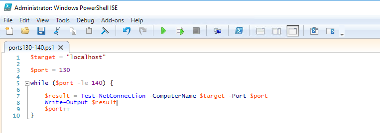
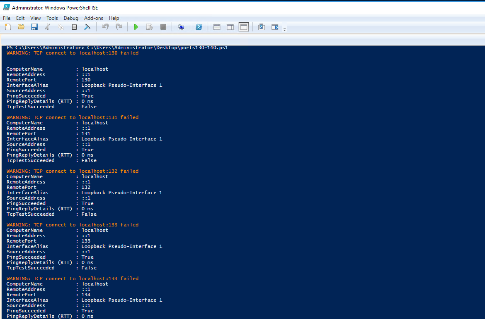

