# Intro

 Whether you have direct shell access and try to live off the land or use a command control infrastructure such as Covenant, PowerShell is a powerful tool to master. This section will cover the basics of PowerShell that will be useful in any engagement. If you do not feel comfortable using PowerShell, please consider revisiting the *“Hacking with PowerShell”* room.

As you have probably noticed, most of the command-line portions of penetration test training focus on using Linux. However, most systems used within a corporate environment are Windows; thus, it is important that the Red Team member feels at home in both operating systems.

There are several PowerShell scripts useful in penetration tests, such as `PowerView` and `Nishang`; however, please remember these two points about them;

1) They are detected by most antivirus software

2) They are detected by most antivirus software

Note: idk if that was a joke or an error from who created the room

Below is a simple test run with the free version of AVG antivirus. As you can see, the `“Get-ComputerDetails.ps1”` script, which is part of `PowerSploit`, has been detected. 

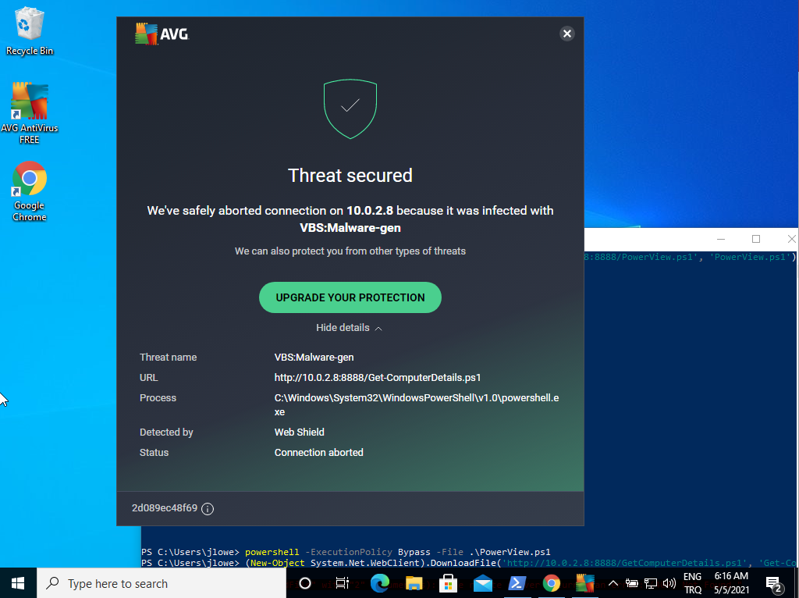

So, if you dream of connecting to a target machine on a corporate network and instantly being able to fire up PowerSploit or Nishang, this might not always be the case. There will, of course, be situations where these scripts will run and be very useful, but do not take them for granted.

On the other hand, being able to use PowerShell will give you the power of an object-oriented programming language readily available on the target platform.

Before moving forward, take time to complete the “Hacking with Powershell” room.

You can connect to the target using SSH with the following credentials:

Username: walter

Password: Kowacs123!

You can then type "powershell" to access PowerShell.

### Is this realistic?

This user simulates you, an attacker, having shell access to the target. As you know, this may be achieved by exploiting an existing vulnerability or through a command injection vulnerability on a web application. 

## Q & A

Q1 What useful PowerShell script did you find on Walter's desktop?

A1 powerview.ps1

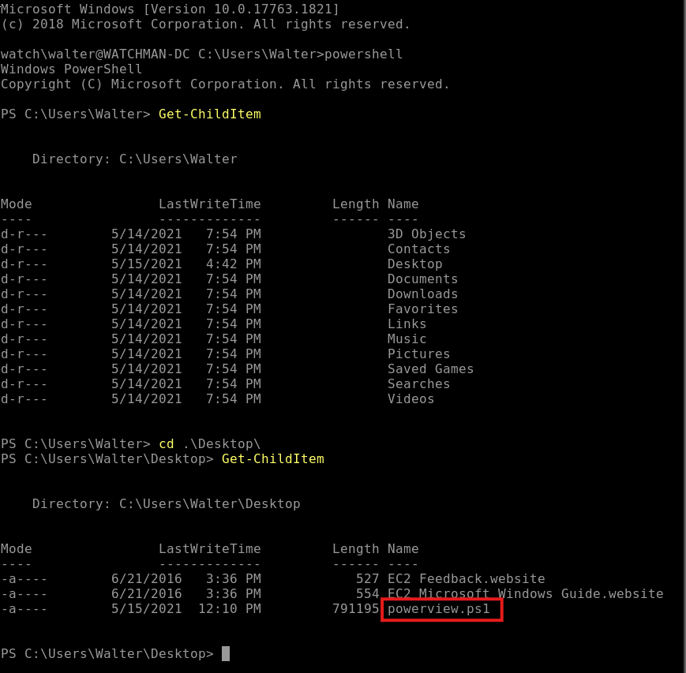

# Manipulating files

The `Start-Process` command can be used to start a process. You can see an example below for notepad.exe.

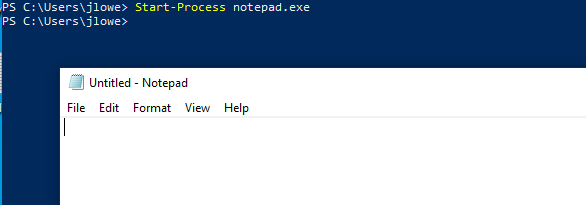

##
`Get-Process` is useful to list all running processes.

It can also be used with the `-name` parameter to filter for a specific process name. 

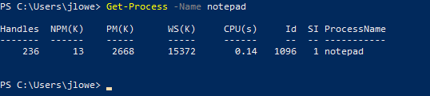

Especially with command outputs that may be difficult to read or need further processing appending the `Export-Csv` command will create a CSV file with the output of the first command. 

##
Similar to `cat` on Linux and `type` on the Windows command-line, `Get-Content` can be used to display the content of a file. 

## 
Files can be copied and moved with `Copy-Item` and `Move-Item`, respectively.

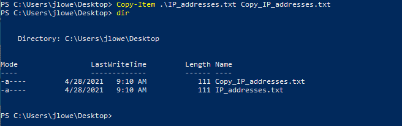

## 
Although not directly related to penetration tests, hashes are handy to compare files or search for malware samples on platforms such as VirusTotal. The built-in `Get-FileHash` command can be used to obtain hashes on most formats. 

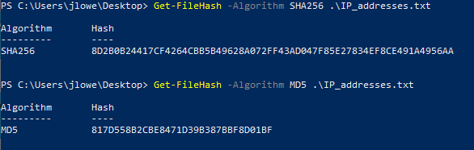

## Q & A

Q1 What is the MD5 hash value of the file on Walter's  desktop?

A1 501570FFBA7FACE69D61DA1A0843E89A

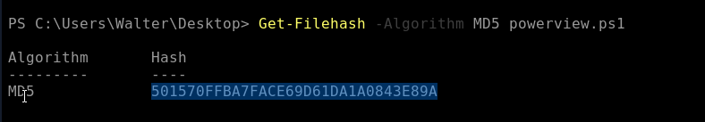

# Downloading files

There are numerous ways to download files from a remote server using PowerShell. One of the quickest ways can be seen below. This will connect to the remote host (10.0.2.8 in this case) and download the `meterpreter-64.ps1`. The file is saved as “meterpreter.ps1”.

The screenshot below shows a sample lab setup used with Kali running a Python HTTP server on port 8888 (`python3 -m http.server 8888`).

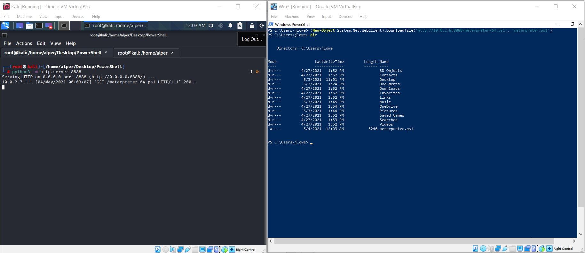

Once the script has been downloaded, you may run into the first related to PowerShell: ExecutionPolicy. It is important to note that, as Microsoft clearly states in the related documentation, “ExecutionPolicy” is NOT a security feature. It merely functions as an added safety measure and can be bypassed by the user. 

The current state of the ExecutionPolicy configuration can be seen using `Get-ExecutionPolicy -list`

Execution policies can have seven different values:

-    AllSigned: Scripts can run but require all scripts to be signed by a trusted publisher.
-    Bypass: All scripts can run, and no warnings or prompts will be displayed.
-    Default: This refers to “restricted” for Windows clients and “RemoteSigned” for Windows servers.
-    RemoteSigned: Scripts can run, and this does not require local scripts to be digitally signed.
-    Restricted: The default configuration for Windows clients. Allows individual commands to run, does not allow scripts.
-    Undefined: This shows that no specific execution policy was set. This means default execution policies will be enforced.
-    Unrestricted: Most scripts will run. 

As mentioned earlier, ExecutionPolicy is not a security feature and can be bypassed by users. The user has several alternatives to bypass the ExecutionPolicy; however, some methods may require the user to have administrator account privileges.

The most common way to bypass execution policy can be seen below:

Another option could be to use `Set-ExecutionPolicy Bypass` with the scope set for the process. The `-scope` parameter will set the execution policy only for the current PowerShell session and will go back to the initial settings once the PowerShell session is closed.

Another easy way to download files from a remote server is to use the `Invoke-WebRequest` command.

# System Reconnaissance

While several PowerShell scripts are readily available for reconnaissance, these may be flagged by the antivirus installed on the target system.

## Finding Missing Patches

The patch level of the target system will have an impact on the steps following the initial compromise. Having an idea about the potentially missing patches could help the red teamer identify a possible privilege escalation path or even provide further information about the target system.

The `Get-Hotfix` command can be used to enumerate already installed patches. 

To make things easier, we could output the result of the `Get-Hotfix` command in a list format and grep it further using the `findstr` command. The example below shows how the installation date of patches could be listed to have a better idea about update cycles on the target.

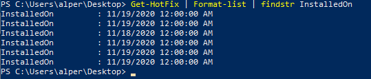

By default, the `Get-HotFix` command will show the output in a table format. This table can be useful to list only data provided in a column without the need to use `findstr` using `Format-Table` followed by the name of the column we are interested in. The example below shows the output listing only `HotFixID`s.

`Format-List` can also be used to gather more information about objects. Below are three examples using a simple `dir` command. 

As you can see, we can access even more information about the file (such as the CreationTime, Last AccessTime, LastWriteTime) using a wildcard `*` after `Format-List` to show all available information.

At any stage, `Out-File` can be used to save the output to a file for further use.

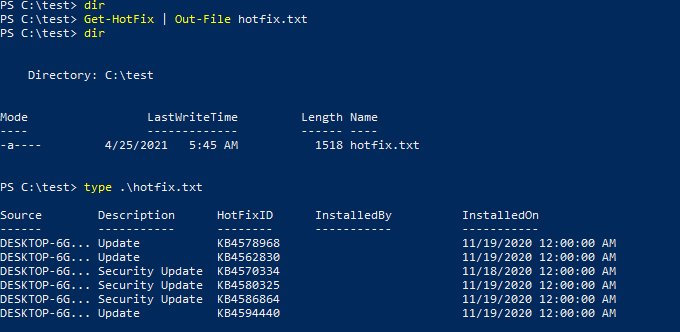

`Get-Content` could also be used to read the file's content just as `type` shown in the example above. Several other output formats are available, including the beautiful GridView option. 

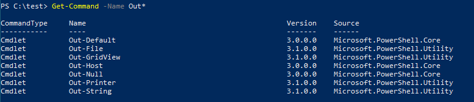

The `Out-GridView` option provides a nice GUI with sortable columns for any output that can be overwhelming on the CLI.

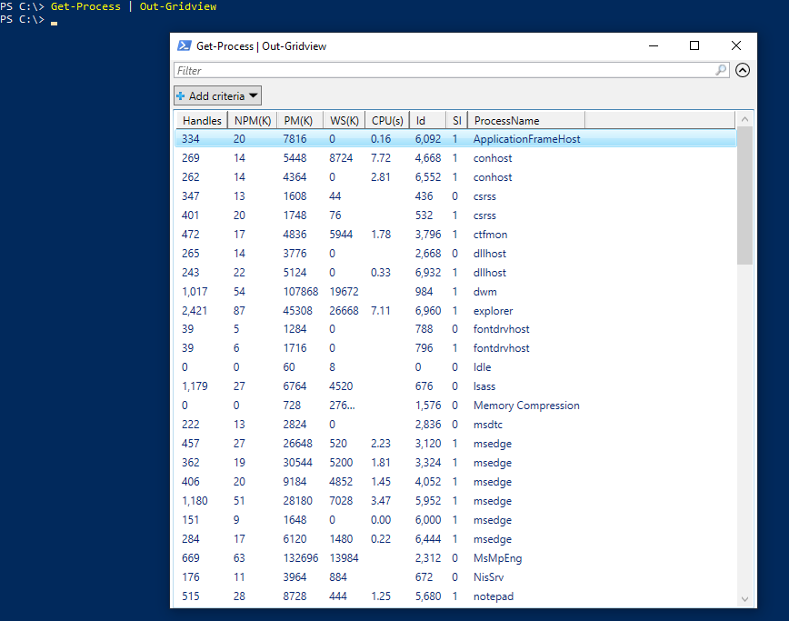

## Q & A

Q1 What Windows Security Update was installed on 5/15/2019?

A1 KB4499728

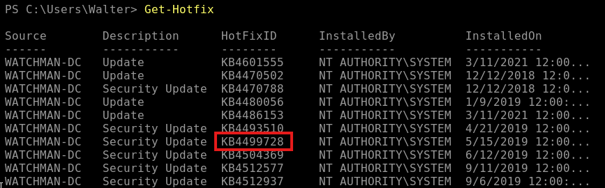

had to RDP into the machine because the machine on the browser was really buggy
but this is a better way to search for the Security Update

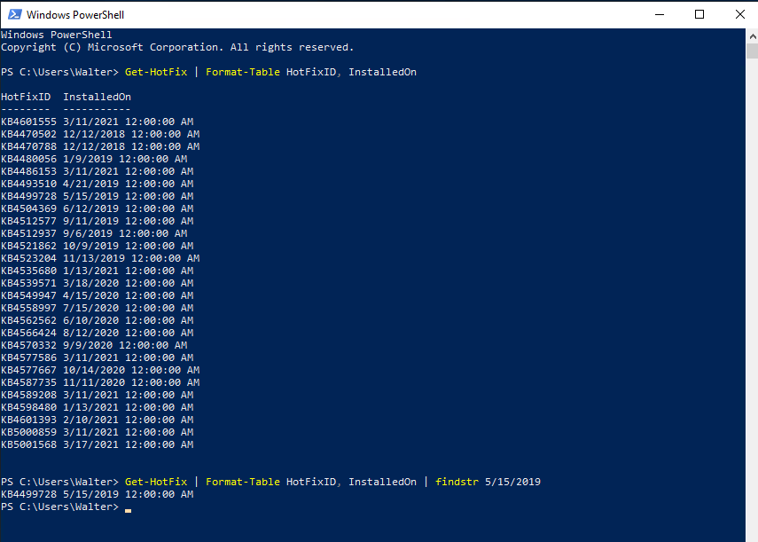

# Network Reconnaissance

The following command can be used to ping a given IP range. In this example, we will ping the IP addresses from 10.0.2.1 to 10.0.2.15

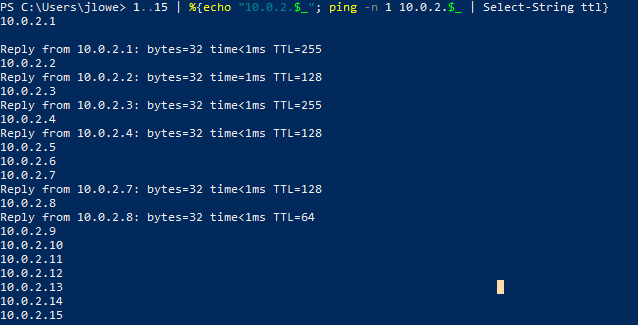

The first part of the command, delimited by the "|" character, sets the range for the last octet. The second part generates and prints the IP address to be used and pipes it to the command line. Finally, the last part greps lines that include the “TTL” string.

A similar command can be built using the existing socket and TCP client functions. In the example below, we scan the first 1024 TCP ports of the target. Note that the “2>$null” sends any error to null, providing us with a cleaner output. 

# Using PowerView

PowerView is one of the most effective ways to gather information on the domain. The module can be downloaded from https://github.com/PowerShellMafia/PowerSploit/blob/dev/Recon/PowerView.ps1

Remember that you may need to bypass the execution policy to be able to run the script.

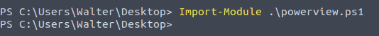

We can now use PowerView.ps1 to obtain more information on the domain configuration and users. 

## Get-NetDomainController

This command will collect information on the domain controller.

Knowing the IP address of the domain controller will be useful to conduct man-in-the-middle attacks and to focus our efforts on high-value targets.

## Get-NetUser

This command will provide a list of domain users. The output can be intimidating, so you may consider exporting the output to a .csv file or use the out-gridview option. 

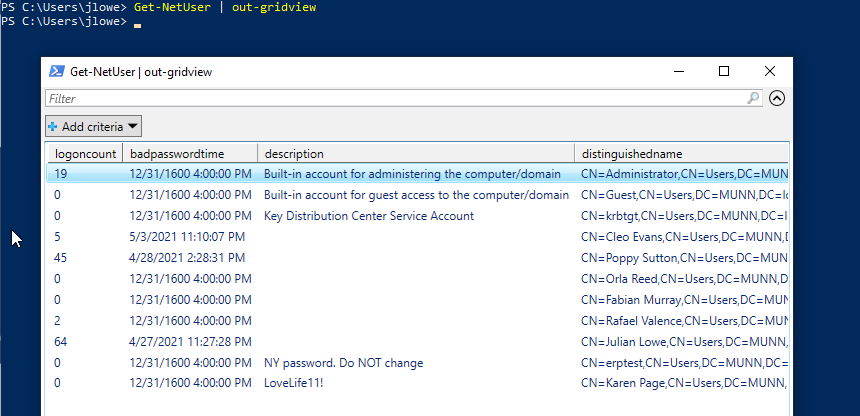

The output can also be limited by providing the name of the criteria we are interested in.

Values for a specific property can be listed. For example, if we wanted to list users' last logon dates and times we could use the `Get-NetUser | select -ExpandProperty lastlogon` command.

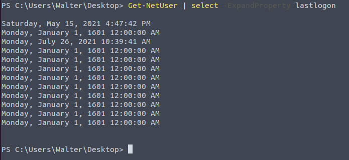

The same command can be modified to select the "description" field instead of "lastlogon" to see if any description was added to accounts. 

## Get-NetComputer

This command is useful to enumerate systems connected to the domain. This command can also be used with the `-ping` parameter to enumerate the systems that are currently online.

## Get-NetGroup

Some accounts can be members of important groups, such as domain admins. Knowing which accounts have useful privileges or are a member of groups of interest will be useful for lateral movement and privilege escalation. The `Get-NetGroup` command will help us enumerate existing groups.

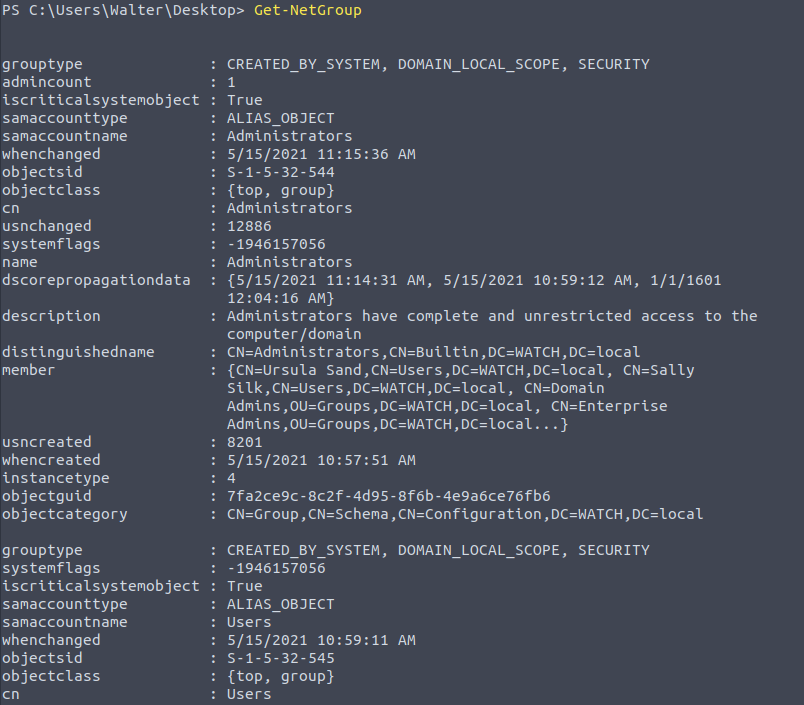

To enumerate members of the group use `Get-NetGroupMember` followed by "Domain Admins".

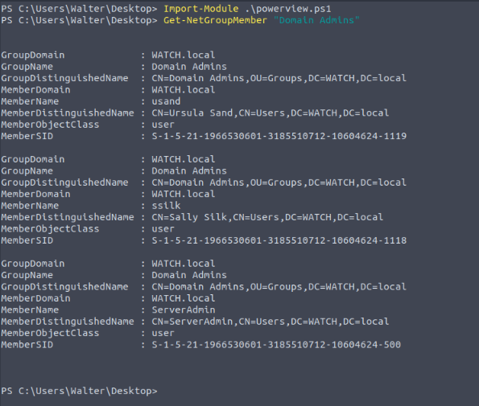

## Finding shares

`Find-DomainShare` will list available shares. Please note we have added the `-CheckShareAccess` option to list only readable shares.

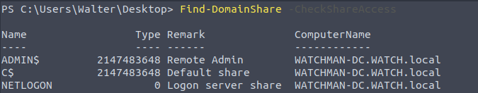

## Enumerate Group Policy

Group Policy is used to configure computers connected to the domain. The `Get-NetGPO` command will gather information on enforced policies. 

Spending some time understanding what policies are set can provide potential attack vectors (is Windows Defender disabled? Is the firewall disabled? Etc.)

The domain you are testing can have a trust relationship with another domain. If this is the case, you may be able to extend the scope of the reconnaissance to that domain. The `Get-NetDomainTrust` command will list any domain you may access. For most of the PowerView commands, all you need to do is to add the `-Domain` parameter followed by the name of the other domain (e.g. Get-NetUsers -Domain infra.munn.local)

## User Enumeration

Knowing which systems the current user can access with local administrator privileges can facilitate lateral movement. The `Find-LocalAdminAccess` command will list systems in the domain you may access as a local administrator.

## Q & A

Q1 One of the accounts has a special description; what is it?

A1 IDF-17828290

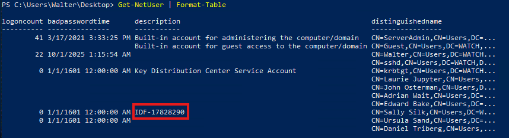
or

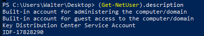

Q2 How many accounts are disabled?

A2 4 for the anwser to mark correct but I can only find 2 and in the last question they only ask for 2 names anyway

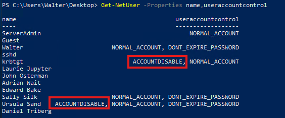

I found screenshots of other people results applying the same commands and it shows 4 accounts

Q3 How many users are in the "domain admins" group?

A3 3

Q4 Which users are in the "domain admins" group? (Listed alphabetically, small, comma-separated, using space)

A4 serveradmin, ssilk, usand

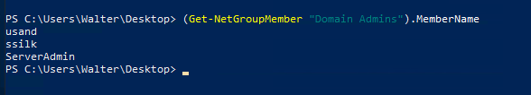

Q5 List shares; what is the name of the "interesting" share?

A5 operationfiles

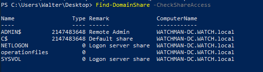
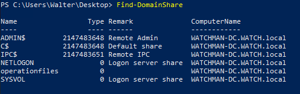

Q6 What is the name of the user-created Group Policy?

A6 Disable Windef

Hint: Something is disabled...

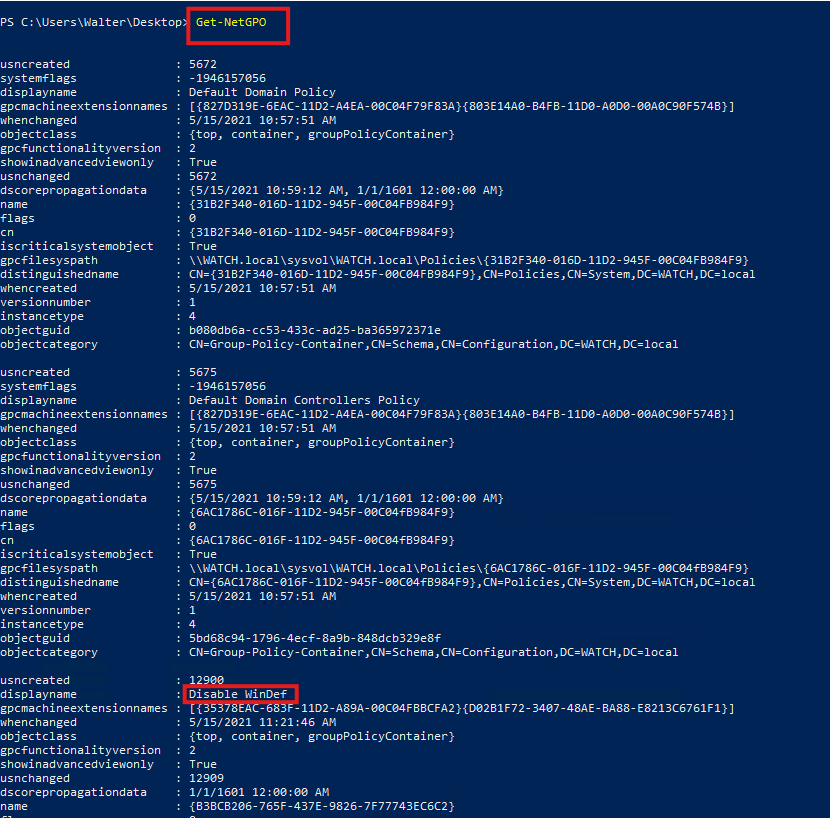

Q7 What are the first names of users' whose accounts were disabled? (Sorted alphabetically, small, comma-separated, using space)

A7 daniel, ursula for it to mark correct, I had to look online, but again these are the names of the users that show disabled for me as shown in A2: krbtgt, ursula
